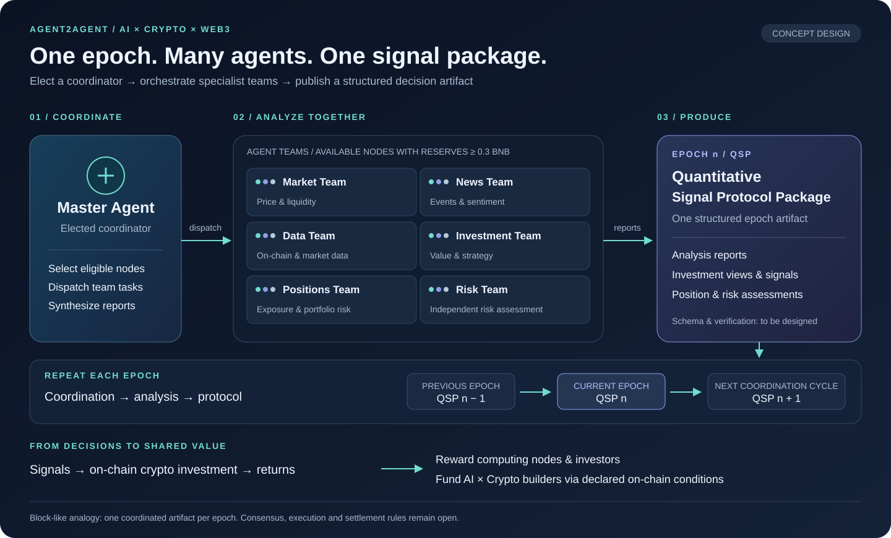
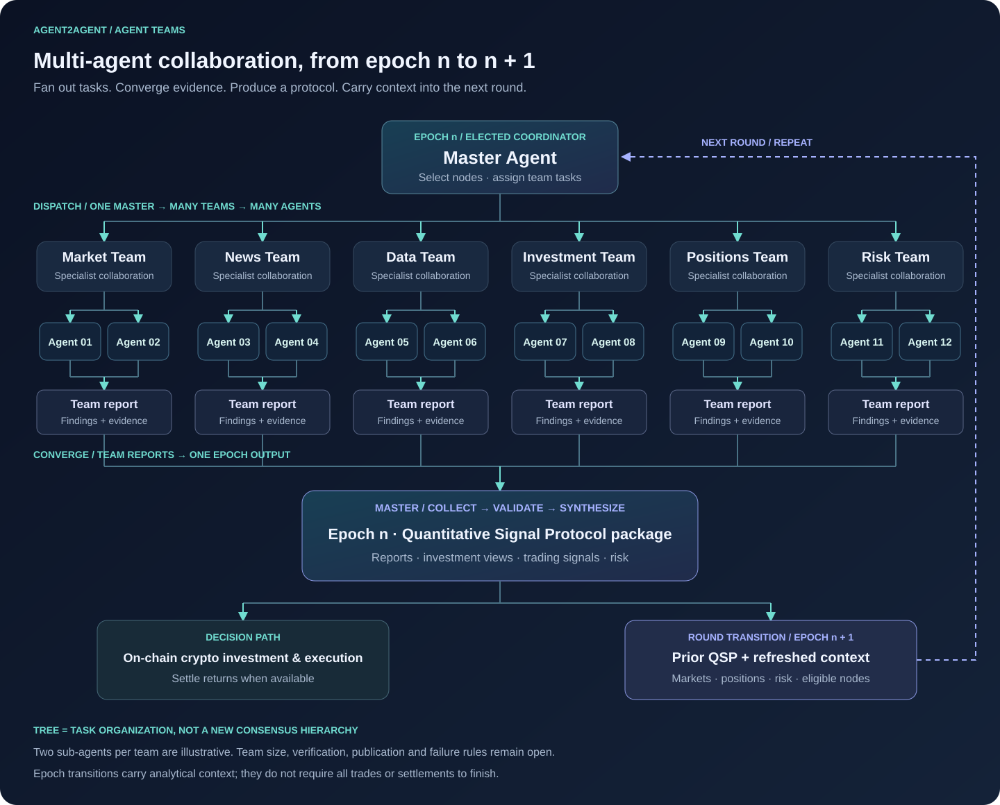
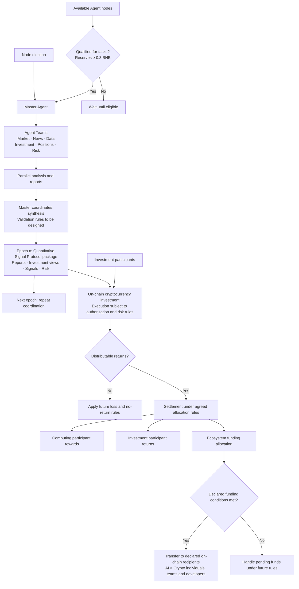

# Agent2Agent

**AI × Crypto × Web3 · An epoch-based network for collaborative investment intelligence**

**English** | [简体中文](README.zh-CN.md)

Agent2Agent (A2A) is a proposed Web3 network where an elected **Master Agent** coordinates specialist **Agent Teams** to produce a **Quantitative Signal Protocol (QSP) package** every epoch. Teams analyze markets, news, data, investment opportunities, portfolio positions and risk. Their findings become a structured output containing analysis reports, investment views and quantitative trading signals.

The central idea is simple: **each epoch, one Master orchestrates many agents to produce one shared signal protocol package**. This draws on the intuition of a block-producing network: a coordinator organizes work for a cycle and produces its defining artifact. In A2A, that artifact is an investment-strategy signal package, primarily focused on **on-chain cryptocurrency investment** through quantitative strategies and value investing.

Investment returns would be shared with participating computing nodes and investors. An agreed portion would also fund individuals, core teams and developers advancing AI, crypto and Web3, through conditions and recipients declared on-chain.

## Contents

- [The core mechanism](#the-core-mechanism)
- [What is a Quantitative Signal Protocol package?](#what-is-a-quantitative-signal-protocol-package)
- [Agent Teams](#agent-teams)
- [Collaboration tree and round lifecycle](#collaboration-tree-and-round-lifecycle)
- [Participation and coordination](#participation-and-coordination)
- [Returns and ecosystem funding](#returns-and-ecosystem-funding)
- [Detailed workflow](#detailed-workflow)
- [Roadmap](#roadmap)
- [Open design questions](#open-design-questions)
- [Contributing](#contributing)
- [License](#license)

## The core mechanism

*One epoch → one coordinated research cycle → one quantitative signal protocol package. The illustration is conceptual; successive outputs do not yet imply a cryptographically linked chain.*

1. **Elect a coordinator.** A node-election mechanism inspired by BSC selects a Master Agent. Election cadence, term length and voting rules remain to be defined.
2. **Form Agent Teams.** For each epoch, the Master selects available, qualified nodes and assigns specialist work. The proposed reserve threshold is **≥ 0.3 BNB**.
3. **Analyze in parallel.** Teams contribute distinct perspectives on market conditions, news, data, investment value, positions and risk.
4. **Synthesize the epoch output.** The Master coordinates completion of the reports and produces the epoch's QSP. Validation and conflict resolution rules remain to be designed.
5. **Use signals under execution rules.** The protocol informs investment decisions; execution is subject to the future custody, authorization and risk-control rules.
6. **Repeat and distribute value.** The network begins its next coordination cycle. When investments generate distributable returns, settlement allocates rewards and ecosystem funding under agreed rules. Settlement need not occur every epoch.

## What is a Quantitative Signal Protocol package?

**A QSP package is the proposed structured output of an epoch and represents its investment strategy**, combining the work of multiple Agent Teams into a common decision artifact. The package primarily targets on-chain cryptocurrencies. “Protocol” names the intended shared format of the strategy package; the technical specification is not yet finalized.

| Proposed component | Purpose |
| --- | --- |
| Epoch context | Identify the cycle and the period covered by the analysis. |
| Analysis reports | Capture findings from the participating specialist teams. |
| Investment strategy | Express strategy assessments and value-investing conclusions for on-chain cryptocurrencies. |
| Asset scope | Identify relevant chains and cryptocurrency assets; exact identifiers remain to be specified. |
| Quantitative signals | Express proposed buy, sell or hold decisions and their rationale. |
| Position and risk assessments | Describe portfolio exposure, position risks and decision constraints. |
| Participation records | Identify contributing agents and evidence supporting their outputs. |

These are proposed components, not a published schema. A finalized design must define validation, publication, provenance and the on-chain/off-chain boundary.

**The block analogy describes cadence and coordinated production.** It does not establish that A2A uses BSC consensus, that QSPs are blockchain blocks, or that an output automatically executes a trade. The core mechanism is an epoch producing an auditable collaboration result that can guide investment.

## Agent Teams

A team is a task-oriented group of sub-agents selected from the network for the current epoch. A team may include multiple nodes; team size and membership rules remain open.

| Team | Analysis focus |
| --- | --- |
| Market | Market structure, prices, liquidity and trading conditions. |
| News | News events, narratives and sentiment. |
| Data | On-chain activity, market datasets and analytical evidence. |
| Investment | Investment opportunities, strategy assessment and value analysis. |
| Positions | Existing holdings, portfolio exposure and position risk. |
| Risk | Risk assessment across team findings and proposed decisions. |

The Master coordinates the teams and synthesizes their results. How independent assessments are verified and disagreements are resolved remains a protocol-design question.

## Collaboration tree and round lifecycle

*Tasks fan out from the Master through Agent Teams to sub-agents. Evidence converges into team reports and one strategy signal package. Two sub-agents per team are illustrative; the tree describes task organization rather than a new consensus hierarchy.*

The proposed lifecycle is:

| Stage | Work performed | Result |
| --- | --- | --- |
| Open epoch | Establish the epoch context, coordinator and eligible nodes. | A task plan for the round. |
| Dispatch and analyze | Assign team tasks and run specialist sub-agent analysis. | Findings and supporting evidence. |
| Collect and validate | Assemble team reports and evaluate their completeness and consistency under future rules. | Inputs ready for strategy synthesis. |
| Synthesize and publish | Combine accepted findings into the epoch's investment strategy. | A QSP package with reports, on-chain cryptocurrency investment views, signals and risk assessments. |
| Carry context forward | Use the prior QSP package and refreshed markets, positions, risk and node availability to prepare the next epoch. | Inputs for a new coordination cycle. |

Publication and validation rules are not yet implemented. Missing, late or conflicting reports require explicit retry, exclusion or round-failure rules in the protocol design.

Once produced, the package follows two related paths: it informs on-chain cryptocurrency investment under execution and risk rules, and it provides analytical context for the next epoch. Actual executions, holdings and risk state must be refreshed separately; a proposed signal alone does not prove a trade occurred. The next epoch does not require all investments or settlements from the previous epoch to finish, and the coordinator may change according to election rules.

## Participation and coordination

- **Master Agent:** the elected coordinator responsible for task assignment, report collection and production of the epoch output.
- **Computing nodes:** available Agent nodes that meet reserve and task requirements and contribute analysis through Agent Teams.
- **Investment participants:** nodes contributing investment capital under the future participation rules.
- **Ecosystem beneficiaries:** declared recipients eligible for conditional funding of AI, crypto or Web3 contributions.

The **0.3 BNB reserve threshold** is a proposed eligibility condition, not a guarantee of selection. Reserve balances, investment capital and funding allocations are separate concepts. Whether reserves are locked, staked or invested remains undecided, as does whether a node may hold multiple roles.

## Returns and ecosystem funding

The proposed allocation of distributable investment returns has three destinations:

| Destination | Intended basis |
| --- | --- |
| Computing participants | Reward eligible contributions to analysis and collaboration. |
| Investment participants | Share returns according to investment participation and agreed rules. |
| AI × Crypto ecosystem builders | Fund individuals, core teams and developers contributing to the advancement of AI, crypto and Web3. |

Potential beneficiaries include contributors and teams active on **X (Twitter)**. A social profile can help identify a contributor; payouts would depend on declared on-chain recipients and funding conditions. No specific person, team or partnership has been designated in this repository.

The funding concept is **contribution recognition → recipient declaration → condition verification → on-chain transfer**. Allocation percentages, contribution measurement, identity-to-address verification, recipient selection and update permissions remain to be specified. Funding is intended to support the people building the ecosystem alongside rewards for network participants.

## Detailed workflow

## Roadmap

The proposed sequence, without committed release dates:

1. Define election, epochs, node eligibility and the QSP specification.
2. Prototype Master coordination and specialist Agent Teams.
3. Evaluate report synthesis, signals and risk controls through backtesting or simulated trading.
4. Validate participation, settlement and conditional funding on a testnet.
5. Complete security review, operational documentation and production-readiness evaluation.

There are no installation or runtime instructions yet. These will be added with the first runnable release.

## Open design questions

- Election rights, coordinator terms, epoch duration and failover.
- Reserve verification, node availability and team selection.
- QSP package schema, publication, missing-report handling, result verification, disagreements and contribution measurement.
- Capital custody, execution permissions, losses and risk limits.
- Return accounting, allocation percentages and settlement timing.
- Beneficiary selection, recipient verification and funding conditions.
- Smart-contract responsibilities and on-chain/off-chain data boundaries.

## Contributing

Contributions to protocol design, multi-agent collaboration, quantitative research, smart contracts and documentation are welcome.

- Open an [Issue](https://github.com/a2a-source/agent2agent/issues) with the problem, proposal and expected outcome.
- Discuss changes to protocol or financial rules before implementing them.
- Submit a Pull Request describing the change and how it was validated.

## License

This project is licensed under the [MIT License](LICENSE).

Copyright © 2026 a2a-source and Agent2Agent contributors.
