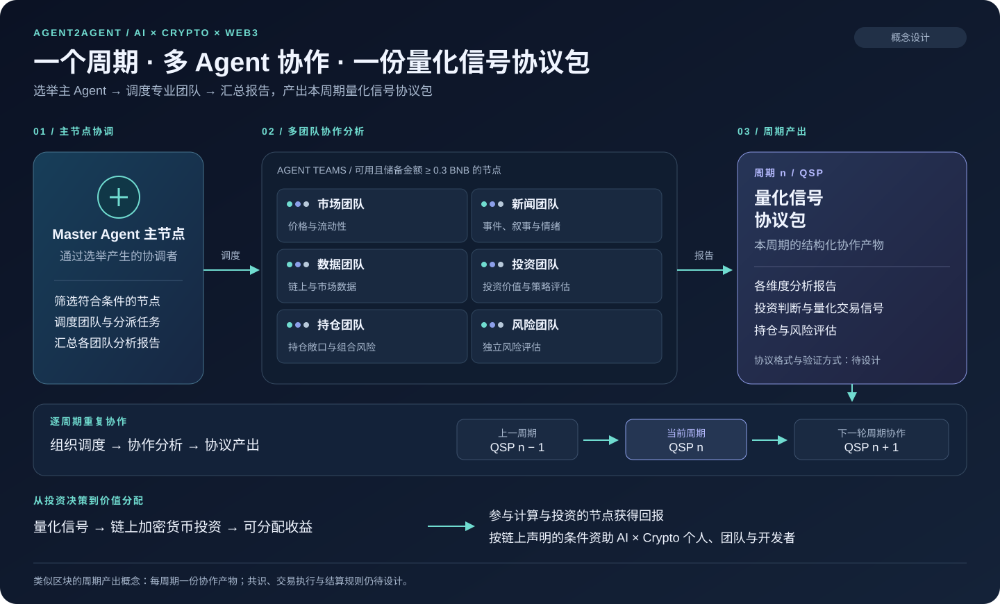
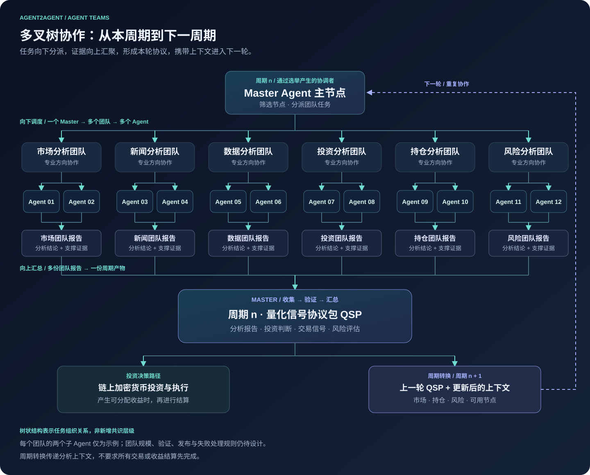
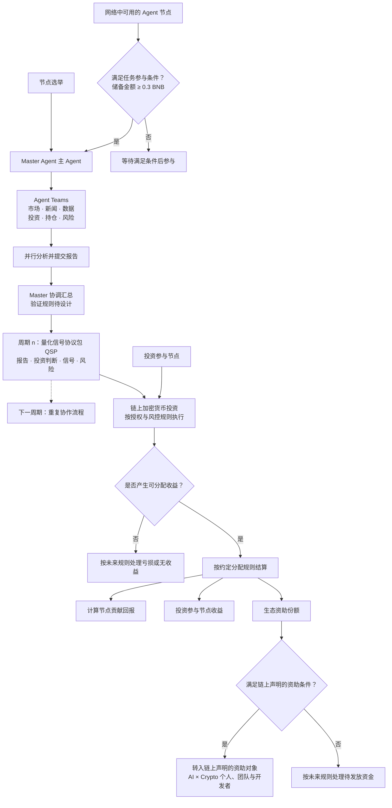

# Agent2Agent

**AI × Crypto × Web3 · 按周期协作、产出投资分析与量化信号的多 Agent 网络**

[English](README.md) | **简体中文**

[](LICENSE)
[](#开发路线)
[](README.md)
[](#参与贡献)


Agent2Agent（A2A）是一个拟议的 Web3 协作网络：通过选举产生 **Master Agent（主 Agent）**，在每个周期组织专业化的 **Agent Teams**，产出一份 **Quantitative Signal Protocol（QSP，量化信号协议包）**。各团队从市场、新闻、数据、投资机会、持仓和风险等维度分析，最终形成包含分析报告、投资判断与量化交易信号的结构化产物。

项目的核心机制是：**每个周期，一个 Master 调度多个 Agent，共同产出一份量化信号协议包。** 这一思路借鉴区块生产网络的直观概念：协调者组织一个周期内的工作，并产生该周期的核心产物。在 A2A 中，这份产物是本轮形成的投资策略信号包，主要面向**链上加密货币投资**，支持量化策略与价值投资。

投资回报将按约定规则分配给参与计算和投资的节点，同时将约定份额用于支持推动 AI、加密技术与 Web3 发展的个人、核心团队和开发者，按照链上声明的资助对象与条件进行转账。

## 首版运行

已提供 TypeScript 与 SQLite 服务、Agent 独立加密钱包、Flap V6 发币适配、税费分账与自动质押、Smart QSP 选举及轮值、故障接替、配置化 LLM 协作和签名报文。真实投资执行与收益分红尚未启用。

需要 Node.js 22.13+：

```sh
npm ci
npm run build
npm test
npm run demo
npm run init
npm start
```

真实研究输出 QSP v2，包含持仓上下文、六个角色报告、Master 总结、证据引用及受约束的目标仓位。BTCB/ETH/WBNB 行情与 DEX 观察均为只读；缺失成本和收益记录时明确标记未知。研究钱包与 RPC 配置见运行说明。

默认禁用链上写入；demo 使用明确标记的模拟链状态与 LLM。参见[运行与 API 说明](docs/usage.md)及[首版协议行为](docs/protocol.md)。以下章节保留项目愿景，未实现的投资与分红能力不属于当前版本。

## 目录

- [核心机制](#核心机制)
- [什么是量化信号协议包](#什么是量化信号协议包)
- [Agent Teams](#agent-teams)
- [协作树与周期处理](#协作树与周期处理)
- [节点参与与协调](#节点参与与协调)
- [收益分配与生态资助](#收益分配与生态资助)
- [详细流程](#详细流程)
- [开发路线](#开发路线)
- [待明确的设计](#待明确的设计)
- [参与贡献](#参与贡献)
- [许可证](#许可证)

## 核心机制



*一个周期 → 一轮多 Agent 协作研究 → 一份量化信号协议包。图中连续周期表示概念上的产出顺序，尚不代表协议之间已通过密码学方式链接成链。*

图示从左到右依次展示 **Master Agent → 六类 Agent Teams → 本周期 QSP**；下方展示周期持续推进，以及投资回报用于节点分红和技术资助的路径。

1. **选举协调者。** 借鉴 BSC 节点选举思路选出 Master Agent，具体选举频率、任期与投票规则待确定。
2. **组成 Agent Teams。** 每个周期由 Master 从网络中选择可用且符合条件的节点，分派专业任务。拟议储备金额门槛为 **≥ 0.3 BNB**。
3. **多维度并行分析。** 各团队分别分析市场、新闻、数据、投资价值、持仓和风险，贡献不同视角。
4. **汇总周期产物。** Master 协调报告完成并汇总产出本周期的 QSP。结果验证与分歧处理规则仍待设计。
5. **按规则使用投资信号。** 协议为投资决策提供依据；交易执行须符合后续制定的资金托管、授权与风控规则。
6. **进入下一周期并分配价值。** 网络继续下一轮协作；投资产生可分配收益后，依据规则结算节点回报与生态资助。收益结算不必与每个分析周期同步。

## 什么是量化信号协议包

**QSP 协议包是一个周期内多 Agent 协作产生的结构化产物，承载本轮形成的投资策略**，把不同团队的分析整合为共同的决策依据。协议包主要面向链上加密货币投资；“协议”指投资策略包拟议采用的统一格式，具体技术规范尚未定稿。

| 拟议组成 | 作用 |
| --- | --- |
| 周期上下文 | 标识当前周期和分析覆盖的时间范围。 |
| 分析报告 | 汇总各专业团队的研究结果。 |
| 投资策略 | 表达面向链上加密货币的策略评估与价值投资结论。 |
| 资产范围 | 标识相关链和加密货币资产，具体标识格式待制定。 |
| 量化信号 | 表达拟议的买入、卖出或持有判断及其依据。 |
| 持仓与风险评估 | 说明资产组合敞口、持仓风险和决策约束。 |
| 参与记录 | 标识贡献 Agent，以及支撑其分析结果的证据。 |

上述内容是拟议组成，不是已发布的数据格式。正式设计还需明确验证、发布、来源记录及链上与链下边界。

**“类似区块”的比喻强调周期和协作产出。** 它不表示 A2A 直接采用 BSC 共识，也不表示 QSP 已经是区块链区块，或产出后自动执行交易。核心在于每个周期产生一份可核验的协作结果，为投资提供依据。

## Agent Teams

Agent Team 是从网络中选择子 Agent，围绕本周期任务组成的专业团队。每个团队可包含多个节点，规模与成员选择规则待确定。

| 团队 | 分析重点 |
| --- | --- |
| 市场分析团队 | 市场结构、价格、流动性与交易环境。 |
| 新闻分析团队 | 新闻事件、市场叙事与情绪。 |
| 数据分析团队 | 链上活动、市场数据与分析证据。 |
| 投资分析团队 | 投资机会、策略评估与价值分析。 |
| 持仓分析团队 | 现有持仓、组合敞口与持仓风险。 |
| 风险分析团队 | 综合审视各团队结果及拟议决策的风险。 |

Master 负责组织协作与汇总结果。各团队独立评估的验证方式，以及出现不同结论时的处理方法，仍需在协议设计中明确。

## 协作树与周期处理



*任务从 Master 经由 Agent Teams 向子 Agent 展开；分析证据汇聚为团队报告，再形成一份投资策略信号包。每个团队两个子 Agent 仅为示例，树状结构表示任务组织关系，并非新增共识层级。*

拟议的每轮处理流程如下：

| 阶段 | 处理内容 | 产物 |
| --- | --- | --- |
| 开启周期 | 确定周期上下文、协调者与符合条件的节点。 | 本轮任务计划。 |
| 调度与分析 | 分派团队任务，由专业子 Agent 开展分析。 | 分析结果与支撑证据。 |
| 收集与验证 | 收集团队报告，按未来规则评估完整性和一致性。 | 可用于策略汇总的输入。 |
| 汇总与发布 | 将符合规则的分析结果整合为本轮投资策略。 | 包含分析报告、链上加密货币投资判断、信号和风险评估的 QSP 协议包。 |
| 传递上下文 | 结合上一轮 QSP 协议包，以及更新后的市场、持仓、风险和节点可用性，准备下一周期。 | 新一轮协作的输入。 |

发布与验证规则尚未实现。对于缺失、迟到或相互矛盾的报告，协议设计需要明确重试、排除或本轮失败的处理规则。

协议包产出后有两条相关路径：一条按执行与风控规则用于链上加密货币投资；另一条为下一周期提供分析上下文。实际执行结果、持仓和风险状态需要另外更新，拟议信号本身不代表交易已经发生。下一周期不要求上一轮所有投资或收益结算先结束，协调者也可以按选举规则发生变化。

## 节点参与与协调

- **Master Agent：** 通过选举产生，负责分派任务、收集报告和组织本周期产物生成。
- **计算节点：** 可用且满足储备金额与任务条件的 Agent 节点，通过 Agent Teams 贡献分析能力。
- **投资参与节点：** 按未来协议规则提供投资资金。
- **生态资助对象：** 已声明并符合资助条件的 AI、加密技术或 Web3 贡献者。

**0.3 BNB 储备门槛**是拟议准入条件，不保证节点被调度。储备余额、实际投资资金和资助份额是不同概念。储备是否锁定、质押或参与投资，以及节点是否能兼任多个角色，尚待确定。

## 收益分配与生态资助

拟议的可分配投资收益有三个去向：

| 去向 | 分配依据 |
| --- | --- |
| 参与计算的节点 | 按符合规则的分析与协作贡献获得回报。 |
| 参与投资的节点 | 按投资参与情况及约定规则分享收益。 |
| AI × Crypto 生态建设者 | 资助推动 AI、加密技术和 Web3 发展的个人、核心团队与开发者。 |

潜在资助对象包括活跃于 **X（Twitter）** 的贡献者与团队。社交账号可以帮助识别贡献者；实际转账则依据链上声明的收款对象和资助条件。本仓库目前尚未指定具体个人、团队或合作关系。

资助概念为：**识别贡献 → 声明资助对象 → 验证触发条件 → 链上转账**。分配比例、贡献计量、身份与收款地址验证、资助对象选择及更新权限均待制定。项目希望在回报网络参与者的同时，持续支持建设 AI 与加密技术生态的人。

## 详细流程



## 开发路线

以下是拟议开发顺序，尚未承诺发布日期：

1. 定义选举、周期、节点准入和 QSP 规范。
2. 构建 Master 调度与专业 Agent Teams 协作原型。
3. 通过回测或模拟交易评估报告汇总、信号与风险控制。
4. 在测试网验证节点参与、收益结算与条件资助流程。
5. 完成安全审查、运行文档与生产环境准备评估。

首版运行方式见上方说明；生产部署需要配置实际链上合约、RPC、LLM 和数据源。

## 待明确的设计

- 选举权、Master 任期、周期时长与故障接替。
- 储备验证、节点可用性与团队选择。
- QSP 协议包格式、发布、报告缺失处理、结果验证、分歧处理与贡献计量。
- 资金托管、执行权限、亏损承担与风险限制。
- 收益核算、分配比例与结算时点。
- 资助对象选择、收款对象验证与触发条件。
- 智能合约职责，以及链上与链下数据边界。

## 参与贡献

欢迎参与协议设计、多 Agent 协作、量化研究、智能合约和文档改进。

- 通过 [Issues](https://github.com/a2a-source/agent2agent/issues) 提出问题、建议与预期结果。
- 涉及协议或资金规则的修改，建议先讨论再实现。
- 通过 Pull Request 提交修改，并说明变更内容与验证方式。

## 许可证

本项目采用 [MIT 许可证](LICENSE)。

Copyright © 2026 a2a-source and Agent2Agent contributors.
